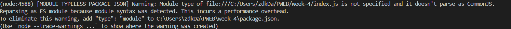
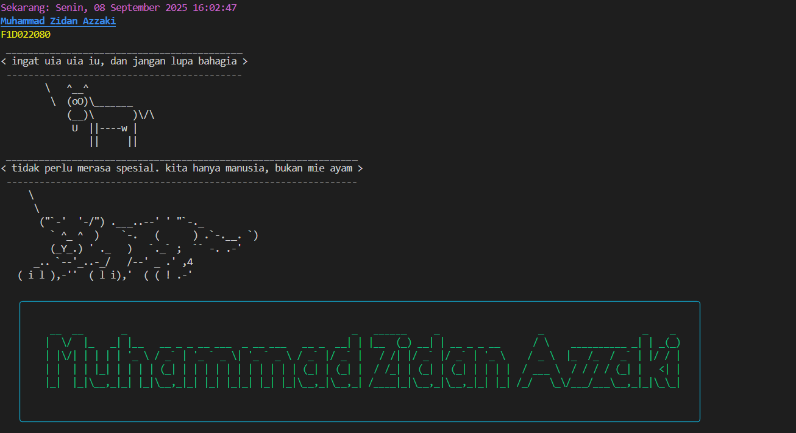

# melakukan instalasi chalk, cowsay, dan figlet dengan memakai npm

npm install chalk cowsay figlet dayjs boxen

# Menjalankan code 

node index.js

dan muncul pesan :

karena memakai syntax module ES tapi belum ada melakukan deklarasi module jadi harus menambahkan ""type": "module"," pada package.json

# hasil 

